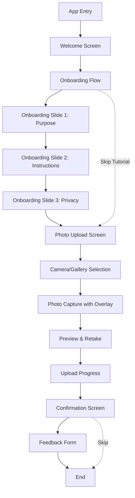
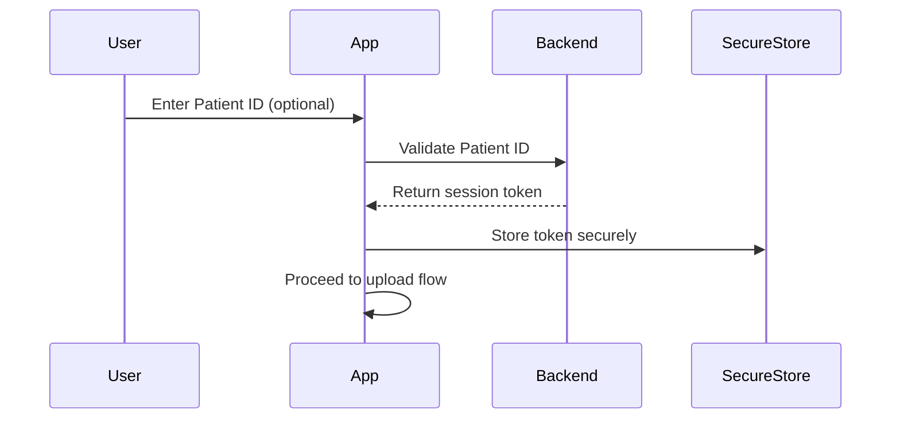
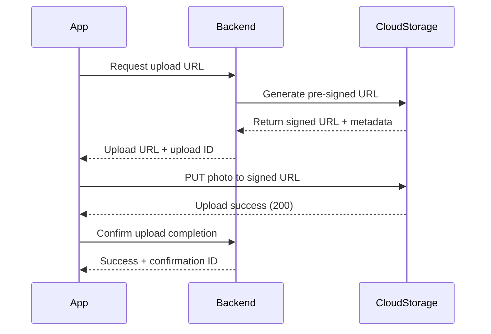
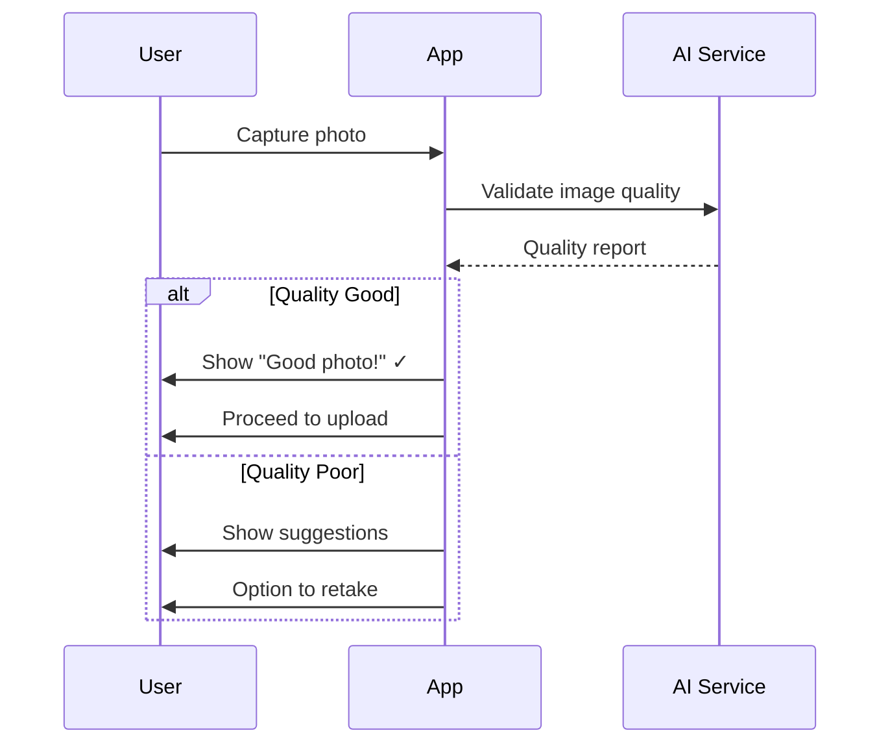
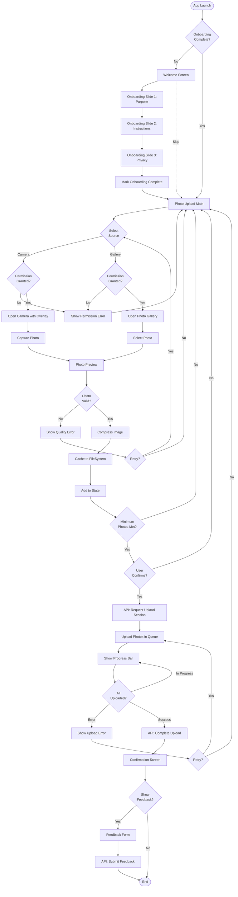
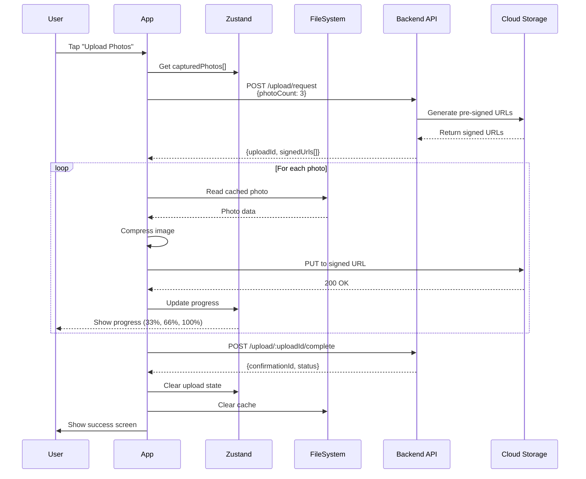
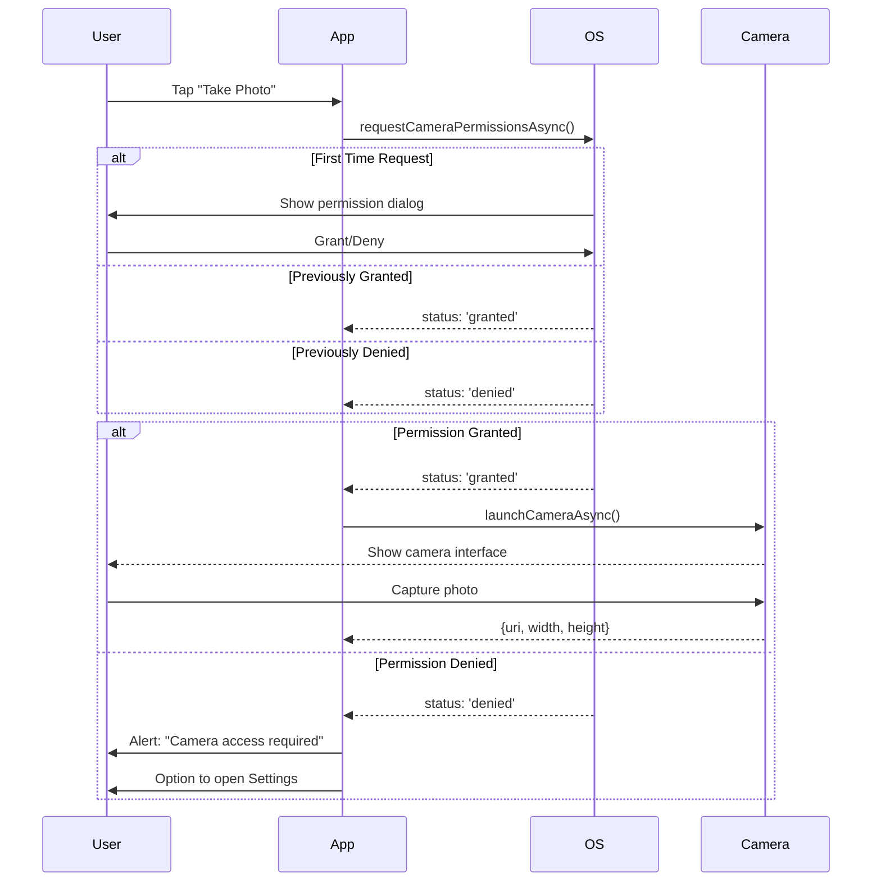
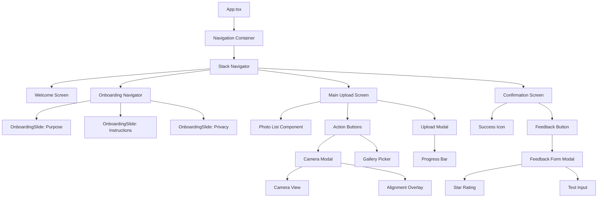

# Patient Hair Upload App – Comprehensive Technical Analysis

---

## Project Overview

**Current State:** Early-stage React Native (Expo ~54.0.20) mobile application scaffold with TypeScript. The project is in its initial prototype phase with minimal implementation.

**Tech Stack Identified:**
- **Frontend Framework:** React Native 0.81.5 with React 19.1.0
- **Development Platform:** Expo ~54.0.20 (New Architecture enabled)
- **Language:** TypeScript ~5.9.2 (strict mode)
- **State Management:** Not yet implemented (PRD recommends Context API or Zustand)
- **Navigation:** Not yet implemented (PRD specifies React Navigation)
- **Backend/Storage:** Not yet implemented (PRD mentions cloud storage API integration)
- **UI Components:** Native React Native components only (no UI library yet)

**Purpose:** Create a seamless mobile experience for patients to capture and upload hair photos for medical consultation, focusing on intuitive onboarding and guided photo capture with minimal friction.

---

## 1. Navigation & App Structure

### Current Implementation
**Status:** ❌ Not Implemented

The app currently consists of a single `App.tsx` component with no navigation system in place. The entry point (`index.ts`) registers the root component using Expo's `registerRootComponent`.

**Current Structure:**
```
index.ts → App.tsx (single screen with placeholder text)
```

### Planned Navigation Architecture (Per PRD)

**Navigation Library:** React Navigation (specified in PRD Section 6.1)

**Recommended Navigation Pattern:** Stack Navigator with the following flow:



**Screen Hierarchy:**

| Screen Level | Screen Name | Type | Purpose |
|--------------|-------------|------|---------|
| 1 | Welcome | Modal/Full Screen | Introduce app purpose, reassure security |
| 2 | Onboarding | Stack Navigator (3-4 slides) | Show photo capture instructions |
| 3 | Photo Upload Main | Stack Screen | Camera/Gallery selection hub |
| 4 | Camera Capture | Modal | Real-time capture with overlay guidance |
| 5 | Preview | Modal | Review photo before upload |
| 6 | Upload Progress | Modal | Progress indicator |
| 7 | Confirmation | Full Screen | Success message |
| 8 | Feedback | Modal/Stack | Optional rating form |

**Deep Linking:** Not specified in current requirements but should consider for future patient record integration.

**Route Guards:** No authentication required based on PRD (standalone upload flow). Future enhancement may add patient authentication.

---

## 2. State Management

### Current Implementation
**Status:** ❌ Not Implemented

No state management library is currently installed or configured.

### Recommended State Management (Per PRD)

**Library:** Context API or Zustand (PRD Section 6.1)

**Recommendation:** **Zustand** for this use case due to:
- Simpler setup than Redux for prototype
- Built-in persistence middleware for offline queue
- Minimal boilerplate
- Excellent TypeScript support
- Lightweight (~1KB)

### Proposed Store Structure

```typescript
// Zustand Store Shape
interface AppState {
  // Onboarding State
  hasCompletedOnboarding: boolean;
  currentOnboardingStep: number;

  // Photo Upload State
  capturedPhotos: PhotoData[];
  uploadQueue: UploadQueueItem[];
  uploadProgress: Record<string, number>; // photoId -> progress %

  // UI State
  isUploading: boolean;
  uploadError: string | null;

  // Feedback
  userFeedback: FeedbackData | null;

  // Actions
  setOnboardingComplete: () => void;
  addPhoto: (photo: PhotoData) => void;
  removePhoto: (photoId: string) => void;
  uploadPhotos: () => Promise<void>;
  submitFeedback: (feedback: FeedbackData) => void;
  resetUploadState: () => void;
}
```

**State Categories:**

1. **Onboarding State**
   - Tracks if user has completed tutorial
   - Current step for progress indicator
   - Skip tutorial preference

2. **Photo Management**
   - Array of captured photos (with local URIs)
   - Metadata: timestamp, view type (front/top/side), quality score
   - Preview state

3. **Upload State**
   - Upload queue for offline capability
   - Per-photo progress tracking
   - Error handling and retry logic

4. **User Feedback**
   - Rating and comments
   - Analytics data (completion time, retake count)

### Persistence Strategy

**Recommended:** Zustand's `persist` middleware with `AsyncStorage`

```typescript
import AsyncStorage from '@react-native-async-storage/async-storage';
import { persist } from 'zustand/middleware';

// Persist only necessary data
const persistConfig = {
  name: 'patient-hair-upload-storage',
  storage: AsyncStorage,
  partialize: (state) => ({
    hasCompletedOnboarding: state.hasCompletedOnboarding,
    uploadQueue: state.uploadQueue, // For offline capability
  }),
};
```

**Note:** Photos should NOT be persisted in state. Use Expo FileSystem for local caching and store only file URIs.

---

## 3. Authentication & Authorization

### Current Implementation
**Status:** ❌ Not Applicable

### Analysis

**No Authentication Required** for the initial prototype based on PRD requirements.

**Rationale:**
- App focuses on anonymous patient photo upload flow
- No user accounts or login required
- Direct upload to backend/cloud storage
- Privacy maintained through anonymization (mentioned in PRD Section 11)

### Future Considerations (Post-MVP)

If authentication is added in future phases:

**Recommended Approach:**
- **Expo SecureStore** for token storage
- **Simple token-based auth** (JWT from backend)
- **Optional patient ID** for linking uploads to medical records

**Future Auth Flow:**


**Authorization:** Not needed for current scope. Future enhancement mentioned in PRD Section 8: "Integration with patient record management system."

---

## 4. Backend Integrations

### Current Implementation
**Status:** ❌ Not Implemented

No backend service, API client, or cloud storage integration exists yet.

### Planned Backend Architecture (Per PRD)

**Backend Type:** Cloud Storage API (PRD Section 6.2 mentions "Cloud storage API (mock or real integration)")

**Recommended Architecture:**

#### Option 1: Direct Cloud Storage (Recommended for Prototype)
**Service:** AWS S3, Google Cloud Storage, or Azure Blob Storage
**Pattern:** Pre-signed URLs for secure uploads



#### Option 2: Backend API with Storage Abstraction
**Pattern:** Multipart upload through backend API
**Tech Stack:** Express.js/Fastify + Multer/Formidable + Cloud SDK

### API Client Configuration

**Recommended Library:** `axios`

```typescript
// api/client.ts
import axios from 'axios';

const apiClient = axios.create({
  baseURL: process.env.EXPO_PUBLIC_API_URL || 'https://api.hairupload.example.com',
  timeout: 30000, // 30s for file uploads
  headers: {
    'Content-Type': 'application/json',
  },
});

// Request interceptor for logging
apiClient.interceptors.request.use(request => {
  console.log('Starting Request', request);
  return request;
});

// Response interceptor for error handling
apiClient.interceptors.response.use(
  response => response,
  error => {
    // Global error handling
    if (error.response?.status === 503) {
      // Show "service unavailable" message
    }
    return Promise.reject(error);
  }
);

export default apiClient;
```

### Proposed API Endpoints

| Method | Endpoint | Purpose | Request Body | Response |
|--------|----------|---------|--------------|----------|
| POST | `/api/upload/request` | Request upload session | `{ patientId?: string, photoCount: number }` | `{ uploadId, signedUrls[] }` |
| PUT | `/api/upload/:uploadId/photo` | Upload photo file | `FormData` with image | `{ photoId, url }` |
| POST | `/api/upload/:uploadId/complete` | Finalize upload | `{ photoIds: string[] }` | `{ confirmationId, status }` |
| GET | `/api/upload/:uploadId/status` | Check upload status | - | `{ status, photos[] }` |
| POST | `/api/feedback` | Submit user feedback | `{ rating, comments, uploadId }` | `{ success: true }` |

### File Upload Implementation

**Image Processing Before Upload:**
```typescript
import * as ImageManipulator from 'expo-image-manipulator';

async function compressImage(uri: string): Promise<string> {
  const manipResult = await ImageManipulator.manipulateAsync(
    uri,
    [{ resize: { width: 1920 } }], // Max width for quality vs size
    { compress: 0.7, format: ImageManipulator.SaveFormat.JPEG }
  );
  return manipResult.uri;
}
```

**Upload Function:**
```typescript
async function uploadPhoto(
  photoUri: string,
  uploadUrl: string,
  onProgress: (progress: number) => void
): Promise<void> {
  const compressedUri = await compressImage(photoUri);

  const formData = new FormData();
  formData.append('photo', {
    uri: compressedUri,
    type: 'image/jpeg',
    name: 'hair-photo.jpg',
  } as any);

  await apiClient.put(uploadUrl, formData, {
    headers: { 'Content-Type': 'multipart/form-data' },
    onUploadProgress: (progressEvent) => {
      const percentCompleted = Math.round(
        (progressEvent.loaded * 100) / progressEvent.total
      );
      onProgress(percentCompleted);
    },
  });
}
```

### Type Safety

**Recommended:** Generate TypeScript types from API schema or define shared types

```typescript
// types/api.ts
export interface UploadRequest {
  patientId?: string;
  photoCount: number;
}

export interface UploadSession {
  uploadId: string;
  signedUrls: string[];
  expiresAt: string;
}

export interface PhotoUploadResult {
  photoId: string;
  url: string;
  thumbnailUrl?: string;
}

export interface UploadConfirmation {
  confirmationId: string;
  status: 'completed' | 'partial' | 'failed';
  photos: PhotoUploadResult[];
}
```

### Analytics Integration (Optional - PRD Section 6.2)

**Recommended:** PostHog or Mixpanel for lightweight mobile analytics

**Events to Track:**
- `onboarding_started`
- `onboarding_completed`
- `onboarding_skipped`
- `photo_captured`
- `photo_retaken`
- `upload_started`
- `upload_completed`
- `upload_failed`
- `feedback_submitted`

---

## 5. AI & LLM Features

### Current Implementation
**Status:** ❌ Not Implemented

### Analysis

**No AI Integration in Current Scope**

The PRD does not specify any LLM or generative AI features for the prototype phase.

### Future Enhancement (PRD Section 8)

**Planned AI Feature:** "AI-based image validation (blur, lighting, angle)"

**Recommended Implementation for Future:**

#### Option 1: Cloud Vision API
**Service:** Google Cloud Vision API or AWS Rekognition
**Purpose:** Real-time image quality analysis

```typescript
// Future implementation example
async function validatePhotoQuality(imageUri: string): Promise<QualityReport> {
  const response = await apiClient.post('/api/validate-image', {
    imageUri,
  });

  return {
    isBlurry: response.data.blur_score > 0.7,
    hasGoodLighting: response.data.brightness_score > 0.5,
    correctAngle: response.data.angle_confidence > 0.8,
    suggestions: response.data.suggestions,
  };
}
```

#### Option 2: On-Device ML
**Framework:** TensorFlow Lite or ONNX Runtime
**Model:** Pre-trained image quality assessment model
**Benefit:** No backend dependency, instant feedback

**AI Integration Flow (Future):**


**No current implementation needed** for prototype phase.

---

## 6. UI Design System & Components

### Current Implementation
**Status:** ⚠️ Basic (Native RN Components Only)

Current `App.tsx` uses only:
- `View` with basic `StyleSheet`
- `Text` component
- `StatusBar` from Expo

### Planned UI Architecture (Per PRD)

**UI Framework:** Custom components (PRD Section 6.1 specifies "Custom components for buttons, modals, image previews")

**Recommended Approach:** Hybrid strategy

#### Recommended UI Libraries

**Option 1: NativeWind (Tailwind for React Native)**
- **Pros:** Rapid prototyping, familiar utility classes, responsive design
- **Cons:** Learning curve if team unfamiliar with Tailwind

**Option 2: React Native Paper**
- **Pros:** Material Design, ready-made components, theming support
- **Cons:** Opinionated design may not match medical app aesthetics

**Option 3: Custom Component Library (Recommended for PRD)**
- **Pros:** Full design control, optimized for specific use case
- **Cons:** More development time

**Recommendation:** Start with **React Native Paper** for rapid prototyping, then customize or replace components as needed.

### Styling Approach

**Current:** `StyleSheet.create()` (standard RN approach)

**Recommended Enhancement:**
```typescript
// theme/index.ts
export const theme = {
  colors: {
    primary: '#2563EB', // Professional blue
    secondary: '#10B981', // Success green
    background: '#FFFFFF',
    surface: '#F9FAFB',
    text: '#111827',
    textSecondary: '#6B7280',
    error: '#EF4444',
    border: '#E5E7EB',
  },
  spacing: {
    xs: 4,
    sm: 8,
    md: 16,
    lg: 24,
    xl: 32,
  },
  typography: {
    h1: { fontSize: 28, fontWeight: '700' },
    h2: { fontSize: 24, fontWeight: '600' },
    body: { fontSize: 16, fontWeight: '400' },
    caption: { fontSize: 14, fontWeight: '400' },
  },
  borderRadius: {
    sm: 8,
    md: 12,
    lg: 16,
    full: 9999,
  },
};
```

### Component Architecture

**Reusable Components to Build:**

| Component | Purpose | Props |
|-----------|---------|-------|
| `Button` | Primary/Secondary actions | `variant`, `onPress`, `loading`, `disabled` |
| `OnboardingSlide` | Illustration + text slides | `title`, `description`, `image` |
| `PhotoCapture` | Camera with overlay guide | `onCapture`, `overlayType` |
| `PhotoPreview` | Review captured photo | `photoUri`, `onRetake`, `onConfirm` |
| `ProgressBar` | Upload progress | `progress` (0-100), `label` |
| `Modal` | Generic modal wrapper | `visible`, `onClose`, `children` |
| `FeedbackForm` | Rating + comment input | `onSubmit` |
| `CameraOverlay` | Head silhouette guide | `viewType` (front/top/side) |

### Animations & Gestures

**Requirements:**
- Smooth screen transitions (onboarding slides)
- Progress bar animations
- Camera overlay fade-in
- Success checkmark animation

**Recommended Libraries:**
- **React Native Reanimated 3** (PRD Section 6.3 mentions "Smooth transitions")
- **React Native Gesture Handler** (for swipe gestures in onboarding)

**Example Animation:**
```typescript
import Animated, { FadeIn, FadeOut } from 'react-native-reanimated';

<Animated.View entering={FadeIn} exiting={FadeOut}>
  <SuccessMessage />
</Animated.View>
```

### Responsive Design

**Orientation:** Portrait-only (specified in `app.json`)

**Screen Size Handling:**
```typescript
import { Dimensions, Platform } from 'react-native';

const { width: SCREEN_WIDTH, height: SCREEN_HEIGHT } = Dimensions.get('window');

const isSmallDevice = SCREEN_HEIGHT < 700; // iPhone SE, etc.
const isTablet = SCREEN_WIDTH >= 768; // iPad support per app.json
```

**Platform-Specific Adjustments:**
```typescript
const styles = StyleSheet.create({
  container: {
    paddingTop: Platform.select({
      ios: 50, // Account for notch
      android: 30,
    }),
  },
});
```

### Forms & Validation

**Feedback Form Validation:**

**Recommended:** React Hook Form + Zod

```typescript
import { useForm } from 'react-hook-form';
import { zodResolver } from '@hookform/resolvers/zod';
import { z } from 'zod';

const feedbackSchema = z.object({
  rating: z.number().min(1).max(5),
  comments: z.string().optional(),
});

type FeedbackFormData = z.infer<typeof feedbackSchema>;

function FeedbackForm() {
  const { control, handleSubmit } = useForm<FeedbackFormData>({
    resolver: zodResolver(feedbackSchema),
  });

  // ...
}
```

**Photo Validation (Client-side):**
```typescript
const photoValidationSchema = z.object({
  uri: z.string().url(),
  fileSize: z.number().max(10 * 1024 * 1024), // Max 10MB
  type: z.enum(['front', 'top', 'side', 'other']),
});
```

---

## 7. Mobile Device Features & Permissions

### Current Implementation
**Status:** ❌ Not Implemented

No native device features or permissions are currently configured.

### Required Device Features (Per PRD)

#### 7.1 Camera Access

**Required Expo Packages:**
- `expo-camera` - Camera access and capture
- `expo-image-picker` - Gallery/camera selection modal

**Installation:**
```bash
npx expo install expo-camera expo-image-picker
```

**Permissions Configuration (`app.json`):**
```json
{
  "expo": {
    "ios": {
      "infoPlist": {
        "NSCameraUsageDescription": "This app needs access to your camera to capture hair photos for analysis.",
        "NSPhotoLibraryUsageDescription": "This app needs access to your photo library to select hair photos."
      }
    },
    "android": {
      "permissions": [
        "CAMERA",
        "READ_EXTERNAL_STORAGE",
        "WRITE_EXTERNAL_STORAGE"
      ]
    }
  }
}
```

**Implementation Pattern:**
```typescript
import * as ImagePicker from 'expo-image-picker';
import { Camera } from 'expo-camera';

async function requestCameraPermission(): Promise<boolean> {
  const { status } = await Camera.requestCameraPermissionsAsync();
  return status === 'granted';
}

async function capturePhoto(): Promise<string | null> {
  const hasPermission = await requestCameraPermission();
  if (!hasPermission) {
    Alert.alert('Permission Denied', 'Camera access is required to capture photos.');
    return null;
  }

  const result = await ImagePicker.launchCameraAsync({
    mediaTypes: ImagePicker.MediaTypeOptions.Images,
    allowsEditing: true,
    aspect: [4, 3],
    quality: 0.8,
  });

  return result.canceled ? null : result.assets[0].uri;
}

async function pickFromGallery(): Promise<string | null> {
  const result = await ImagePicker.launchImageLibraryAsync({
    mediaTypes: ImagePicker.MediaTypeOptions.Images,
    allowsEditing: true,
    quality: 0.8,
  });

  return result.canceled ? null : result.assets[0].uri;
}
```

#### 7.2 File System & Storage

**Required Package:** `expo-file-system`

**Use Cases:**
- Temporary photo caching before upload
- Storing compressed images
- Offline upload queue management

**Implementation:**
```typescript
import * as FileSystem from 'expo-file-system';

const CACHE_DIR = `${FileSystem.cacheDirectory}hair-photos/`;

async function cachePhoto(uri: string, photoId: string): Promise<string> {
  await FileSystem.makeDirectoryAsync(CACHE_DIR, { intermediates: true });
  const cachedPath = `${CACHE_DIR}${photoId}.jpg`;
  await FileSystem.copyAsync({ from: uri, to: cachedPath });
  return cachedPath;
}

async function clearPhotoCache(): Promise<void> {
  await FileSystem.deleteAsync(CACHE_DIR, { idempotent: true });
}
```

#### 7.3 Secure Storage (Future)

**Package:** `expo-secure-store`

**Use Case:** Store upload confirmation IDs or future patient tokens securely

```typescript
import * as SecureStore from 'expo-secure-store';

async function saveUploadConfirmation(confirmationId: string): Promise<void> {
  await SecureStore.setItemAsync('last_upload_id', confirmationId);
}
```

#### 7.4 Notifications (Future)

**Not required for MVP** but PRD Section 8 may benefit from local notifications:
- "Upload complete" notification for background uploads
- Reminder to complete feedback form

**Package:** `expo-notifications`

#### 7.5 Offline Capability (PRD Section 8)

**Feature:** "Offline photo queue and auto-sync"

**Implementation Strategy:**
```typescript
import NetInfo from '@react-native-community/netinfo';

// Monitor network status
const unsubscribe = NetInfo.addEventListener(state => {
  if (state.isConnected && state.isInternetReachable) {
    // Trigger offline queue processing
    processUploadQueue();
  }
});
```

#### 7.6 Haptic Feedback

**Package:** `expo-haptics`

**Use Cases:**
- Successful photo capture (light impact)
- Upload complete (success notification)
- Error feedback (error notification)

```typescript
import * as Haptics from 'expo-haptics';

function onPhotoCaptured() {
  Haptics.notificationAsync(Haptics.NotificationFeedbackType.Success);
}
```

### Permissions Summary Table

| Feature | iOS Permission | Android Permission | Required | Future |
|---------|----------------|-------------------|----------|--------|
| Camera | `NSCameraUsageDescription` | `CAMERA` | ✅ Yes | - |
| Photo Library | `NSPhotoLibraryUsageDescription` | `READ_EXTERNAL_STORAGE` | ✅ Yes | - |
| File System | Automatic | `WRITE_EXTERNAL_STORAGE` | ✅ Yes | - |
| Notifications | `NSUserNotificationsUsageDescription` | - | ❌ No | ⚠️ Future |
| Secure Storage | Automatic (Keychain) | Automatic | ❌ No | ⚠️ Future |

---

## 8. Environment & Configuration

### Current Implementation

**app.json Configuration:**
```json
{
  "expo": {
    "name": "patient-hair-upload-app",
    "slug": "patient-hair-upload-app",
    "version": "1.0.0",
    "orientation": "portrait",
    "newArchEnabled": true,
    "ios": { "supportsTablet": true },
    "android": { "edgeToEdgeEnabled": true }
  }
}
```

**TypeScript Configuration:**
```json
{
  "extends": "expo/tsconfig.base",
  "compilerOptions": {
    "strict": true
  }
}
```

### Recommended Environment Setup

#### 8.1 Environment Variables

**Package:** `expo-constants` (built-in) or `react-native-dotenv`

**Create `.env` files:**

**.env.development:**
```env
EXPO_PUBLIC_API_URL=http://localhost:3000/api
EXPO_PUBLIC_STORAGE_URL=http://localhost:3000/storage
EXPO_PUBLIC_ENABLE_ANALYTICS=false
EXPO_PUBLIC_ENABLE_LOGGING=true
```

**.env.production:**
```env
EXPO_PUBLIC_API_URL=https://api.hairupload.com
EXPO_PUBLIC_STORAGE_URL=https://storage.hairupload.com
EXPO_PUBLIC_ENABLE_ANALYTICS=true
EXPO_PUBLIC_ENABLE_LOGGING=false
```

**Access in Code:**
```typescript
import Constants from 'expo-constants';

const config = {
  apiUrl: process.env.EXPO_PUBLIC_API_URL || Constants.expoConfig?.extra?.apiUrl,
  enableAnalytics: process.env.EXPO_PUBLIC_ENABLE_ANALYTICS === 'true',
};
```

#### 8.2 Build Variants

**Development vs Production:**

**app.config.js (dynamic config):**
```javascript
const IS_PRODUCTION = process.env.APP_ENV === 'production';

export default {
  expo: {
    name: IS_PRODUCTION ? 'Hair Upload' : 'Hair Upload (Dev)',
    slug: 'patient-hair-upload-app',
    ios: {
      bundleIdentifier: IS_PRODUCTION
        ? 'com.clinic.hairupload'
        : 'com.clinic.hairupload.dev',
    },
    android: {
      package: IS_PRODUCTION
        ? 'com.clinic.hairupload'
        : 'com.clinic.hairupload.dev',
    },
    extra: {
      apiUrl: process.env.EXPO_PUBLIC_API_URL,
      eas: { projectId: 'YOUR_PROJECT_ID' },
    },
  },
};
```

#### 8.3 OTA Updates (Expo Updates)

**Already Available:** Expo projects include OTA updates by default

**Configuration:**
```json
{
  "expo": {
    "updates": {
      "url": "https://u.expo.dev/YOUR_PROJECT_ID",
      "fallbackToCacheTimeout": 0
    }
  }
}
```

**Check for Updates:**
```typescript
import * as Updates from 'expo-updates';

async function checkForUpdates() {
  if (!__DEV__) {
    const update = await Updates.checkForUpdateAsync();
    if (update.isAvailable) {
      await Updates.fetchUpdateAsync();
      await Updates.reloadAsync();
    }
  }
}
```

#### 8.4 Analytics & Monitoring

**Recommended Services:**
- **PostHog** (privacy-friendly, self-hostable) - PRD mentions analytics tracking
- **Sentry** (error tracking)

**Installation:**
```bash
npx expo install @sentry/react-native
npx expo install posthog-react-native
```

**Sentry Setup:**
```typescript
import * as Sentry from '@sentry/react-native';

Sentry.init({
  dsn: process.env.EXPO_PUBLIC_SENTRY_DSN,
  enableInExpoDevelopment: false,
  debug: __DEV__,
  tracesSampleRate: 1.0,
});
```

**PostHog Setup:**
```typescript
import PostHog from 'posthog-react-native';

const posthog = new PostHog(
  process.env.EXPO_PUBLIC_POSTHOG_API_KEY!,
  { host: 'https://app.posthog.com' }
);

// Track events per PRD Section 6.2
posthog.capture('onboarding_started');
posthog.capture('photo_captured', { photoType: 'front' });
posthog.capture('upload_completed', { photoCount: 3, duration: 12.5 });
```

#### 8.5 Logging Strategy

**Development:**
```typescript
const logger = {
  info: (message: string, meta?: any) => {
    if (__DEV__) console.log(`[INFO] ${message}`, meta);
  },
  error: (message: string, error?: Error) => {
    if (__DEV__) console.error(`[ERROR] ${message}`, error);
    else Sentry.captureException(error);
  },
};
```

**Production:** Disable all `console.log` statements using Babel plugin.

#### 8.6 Feature Flags (Future)

**For A/B testing or gradual rollout:**

```typescript
const features = {
  enableOfflineQueue: true,
  enableFeedbackForm: true,
  enableAIValidation: false, // Future feature
};
```

---

## 9. Security & Best Practices

### Current Implementation
**Status:** ⚠️ Basic (TypeScript strict mode enabled)

### Security Analysis

#### 9.1 Secure Data Handling

**Current Risk:** No sensitive data handling yet

**Requirements for Implementation:**

| Data Type | Storage Method | Security Level |
|-----------|----------------|----------------|
| Captured Photos | `FileSystem.cacheDirectory` | Low (temporary files) |
| Upload Confirmation ID | `AsyncStorage` | Medium (not sensitive) |
| Future Patient Tokens | `SecureStore` | High (encrypted) |

**Best Practices:**
```typescript
// ❌ Bad: Storing sensitive data
await AsyncStorage.setItem('patient_token', token);

// ✅ Good: Use SecureStore for sensitive data
await SecureStore.setItemAsync('patient_token', token, {
  keychainAccessible: SecureStore.WHEN_UNLOCKED,
});
```

#### 9.2 Network Security

**HTTPS Enforcement:**
```typescript
// Validate API URLs
function validateApiUrl(url: string): boolean {
  return url.startsWith('https://') || __DEV__;
}
```

**Certificate Pinning (Future):**
For production, consider certificate pinning to prevent MITM attacks:
```bash
npx expo install expo-ssl-pinning
```

#### 9.3 Input Validation

**Photo Upload Validation:**
```typescript
import { z } from 'zod';

const PhotoUploadSchema = z.object({
  uri: z.string().startsWith('file://'),
  type: z.enum(['image/jpeg', 'image/png']),
  fileSize: z.number().max(10 * 1024 * 1024), // 10MB max
  width: z.number().min(800), // Minimum resolution
  height: z.number().min(600),
});

function validatePhoto(photo: any): boolean {
  const result = PhotoUploadSchema.safeParse(photo);
  if (!result.success) {
    console.error('Photo validation failed:', result.error);
    return false;
  }
  return true;
}
```

**Feedback Form Validation:**
```typescript
const FeedbackSchema = z.object({
  rating: z.number().int().min(1).max(5),
  comments: z.string().max(500).optional(),
  uploadId: z.string().uuid(),
});
```

#### 9.4 Error Handling Strategy

**Global Error Boundary:**
```typescript
import React from 'react';
import * as Sentry from '@sentry/react-native';

class ErrorBoundary extends React.Component {
  componentDidCatch(error: Error, errorInfo: React.ErrorInfo) {
    Sentry.captureException(error);
    // Show fallback UI
  }

  render() {
    return this.props.children;
  }
}
```

**API Error Handling:**
```typescript
async function uploadPhoto(photo: PhotoData): Promise<void> {
  try {
    const response = await apiClient.post('/upload', photo);
    return response.data;
  } catch (error) {
    if (axios.isAxiosError(error)) {
      if (error.response?.status === 413) {
        throw new Error('Photo file is too large. Please compress and try again.');
      }
      if (error.response?.status === 503) {
        throw new Error('Service temporarily unavailable. Please try again later.');
      }
    }
    throw new Error('Upload failed. Please check your connection and retry.');
  }
}
```

#### 9.5 Rate Limiting & Abuse Prevention

**Client-side Upload Throttling:**
```typescript
import { debounce } from 'lodash';

const debouncedUpload = debounce(uploadPhotos, 2000, {
  leading: true,
  trailing: false,
});

// Prevents rapid-fire upload button clicks
<Button onPress={debouncedUpload} />
```

**Retry Logic with Exponential Backoff:**
```typescript
async function uploadWithRetry(
  uploadFn: () => Promise<void>,
  maxRetries = 3
): Promise<void> {
  for (let attempt = 0; attempt < maxRetries; attempt++) {
    try {
      await uploadFn();
      return;
    } catch (error) {
      if (attempt === maxRetries - 1) throw error;
      const delay = Math.pow(2, attempt) * 1000; // 1s, 2s, 4s
      await new Promise(resolve => setTimeout(resolve, delay));
    }
  }
}
```

#### 9.6 Code Security Practices

**Environment Variable Protection:**
```javascript
// ❌ Bad: Hardcoded secrets
const API_KEY = 'sk-1234567890abcdef';

// ✅ Good: Environment variables
const API_KEY = process.env.EXPO_PUBLIC_API_KEY;

// ❌ Bad: Committing .env to git
// Add to .gitignore:
.env
.env.local
.env.production
```

**Production Build Checks:**
```typescript
// Remove console.logs in production
if (__DEV__) {
  console.log('Debug info:', debugData);
}

// Disable dev tools
const enableDevTools = __DEV__ && !process.env.DISABLE_DEV_TOOLS;
```

#### 9.7 Privacy & GDPR Compliance

**Per PRD Section 3.1:** "Information about privacy, storage, and consent"

**Required UI Elements:**
- Privacy policy link on welcome screen
- Data retention explanation
- Option to delete uploaded photos (future)
- Anonymization notice (PRD Section 11)

**Data Minimization:**
```typescript
// Only collect necessary metadata
const photoMetadata = {
  uploadId: generateId(),
  timestamp: Date.now(),
  viewType: 'front', // Required for medical analysis
  // ❌ Do NOT collect: deviceId, location, user identifiers
};
```

#### 9.8 Dependency Security

**Audit Dependencies Regularly:**
```bash
npm audit
npm audit fix
```

**Keep Expo SDK Updated:**
```bash
npx expo-doctor  # Check for issues
npx expo upgrade # Upgrade to latest SDK
```

---

## 10. Screen-to-Data Mapping

### Comprehensive Flow Mapping

| Screen | State Used | API Calls | Device Features | Validation |
|--------|------------|-----------|-----------------|------------|
| **Welcome** | `hasCompletedOnboarding` | None | None | None |
| **Onboarding Slides** | `currentOnboardingStep` | None | None | None |
| **Photo Upload Main** | `capturedPhotos[]` | None | None | None |
| **Camera Capture** | `capturedPhotos[]` | None | Camera, FileSystem | Photo quality check |
| **Photo Preview** | `capturedPhotos[]`, `uploadProgress` | `POST /upload/request` | FileSystem (cache) | Image validation |
| **Upload Progress** | `uploadProgress`, `isUploading`, `uploadError` | `PUT /upload/:id/photo` | Network status | Upload status |
| **Confirmation** | `uploadError` | `POST /upload/:id/complete` | None | None |
| **Feedback Form** | `userFeedback` | `POST /feedback` | None | Form validation (Zod) |

---

## 11. Architecture Diagrams

### 11.1 Complete User Journey Flow



### 11.2 State Management Architecture

```mermaid
graph TB
    subgraph "Zustand Store"
        OnboardingState[Onboarding State<br/>- hasCompleted<br/>- currentStep]
        PhotoState[Photo State<br/>- capturedPhotos[]<br/>- uploadQueue[]]
        UploadState[Upload State<br/>- isUploading<br/>- progress{}<br/>- error]
        FeedbackState[Feedback State<br/>- rating<br/>- comments]
    end

    subgraph "Persistence Layer"
        AsyncStorage[(AsyncStorage)]
        FileSystem[(FileSystem Cache)]
    end

    subgraph "Components"
        OnboardingScreens[Onboarding Screens]
        CameraScreen[Camera Screen]
        UploadScreen[Upload Screen]
        FeedbackScreen[Feedback Screen]
    end

    OnboardingScreens <-->|read/write| OnboardingState
    CameraScreen <-->|read/write| PhotoState
    UploadScreen <-->|read/write| UploadState
    FeedbackScreen <-->|read/write| FeedbackState

    OnboardingState -->|persist| AsyncStorage
    PhotoState -->|cache files| FileSystem
    UploadState -.queue.-> AsyncStorage
```

### 11.3 API Upload Sequence



### 11.4 Camera Permission Flow



### 11.5 Component Hierarchy



---

## 12. Recommended Dependencies

### Essential Packages to Install

```bash
# Navigation
npx expo install @react-navigation/native @react-navigation/stack
npx expo install react-native-screens react-native-safe-area-context

# State Management
npm install zustand
npm install @react-native-async-storage/async-storage

# Camera & Media
npx expo install expo-camera expo-image-picker expo-image-manipulator

# File System
npx expo install expo-file-system

# Forms & Validation
npm install react-hook-form @hookform/resolvers zod

# HTTP Client
npm install axios

# Animations
npx expo install react-native-reanimated react-native-gesture-handler

# Utilities
npm install lodash
npm install date-fns

# Development
npm install -D @types/lodash
```

### Optional (Future Enhancements)

```bash
# Analytics
npm install posthog-react-native

# Error Tracking
npx expo install @sentry/react-native

# Notifications
npx expo install expo-notifications

# Haptics
npx expo install expo-haptics

# Network Status
npm install @react-native-community/netinfo

# Secure Storage
npx expo install expo-secure-store
```

---

## 13. Implementation Roadmap

### Phase 1: Foundation (Week 1-2)
- ✅ Project scaffold (Complete)
- ⬜ Install dependencies
- ⬜ Setup navigation structure
- ⬜ Configure Zustand store
- ⬜ Create theme and base components

### Phase 2: Onboarding (Week 2-3)
- ⬜ Welcome screen
- ⬜ Onboarding slide components
- ⬜ Onboarding state management
- ⬜ Skip tutorial logic

### Phase 3: Photo Capture (Week 3-4)
- ⬜ Camera permission handling
- ⬜ Camera UI with overlay
- ⬜ Gallery picker integration
- ⬜ Photo preview screen
- ⬜ Image compression

### Phase 4: Upload Flow (Week 4-5)
- ⬜ Backend API client
- ⬜ Upload request logic
- ⬜ Progress tracking
- ⬜ Error handling & retry
- ⬜ Success confirmation

### Phase 5: Feedback & Polish (Week 5-6)
- ⬜ Feedback form
- ⬜ Analytics integration
- ⬜ Animations & transitions
- ⬜ Testing & bug fixes
- ⬜ Performance optimization

### Phase 6: Future Enhancements (Post-MVP)
- ⬜ AI image validation
- ⬜ Offline queue
- ⬜ Localization (EN/TR)
- ⬜ Patient record integration

---

## 14. Success Metrics (Per PRD Section 7)

| Metric | Target | Measurement Method |
|--------|--------|-------------------|
| Onboarding completion rate | ≥ 90% | PostHog: `onboarding_completed` / `onboarding_started` |
| Successful upload rate | ≥ 95% | PostHog: `upload_completed` / `upload_started` |
| Average upload time | ≤ 10 seconds | Track time between `upload_started` and `upload_completed` |
| User satisfaction score | ≥ 4.5/5 | Average of feedback form ratings |
| Photo retake rate | < 20% | PostHog: `photo_retaken` / `photo_captured` |
| Permission grant rate | ≥ 85% | Camera/gallery permission acceptance |

---

## 15. Known Limitations & Technical Debt

### Current Limitations
1. **No Backend:** API integration is theoretical; backend must be developed separately
2. **No Authentication:** Anonymous uploads only (per PRD)
3. **No AI Validation:** Quality checks are manual/basic in MVP
4. **No Offline Support:** Real-time upload only (future enhancement)
5. **Single Language:** English only (PRD mentions EN/TR for future)

### Technical Debt to Address
1. Replace `any` types with proper TypeScript interfaces
2. Add unit tests for state management and utilities
3. Implement E2E tests for critical user flows
4. Add accessibility features (screen reader support, high contrast)
5. Optimize image compression algorithm based on real-world testing
6. Implement proper error boundary components
7. Add logging infrastructure for production debugging

---

## 16. References & Resources

### Documentation
- [Expo Documentation](https://docs.expo.dev)
- [React Navigation Docs](https://reactnavigation.org/docs/getting-started)
- [Zustand GitHub](https://github.com/pmndrs/zustand)
- [React Hook Form](https://react-hook-form.com)
- [Zod](https://zod.dev)

### Similar Apps (Per PRD Section 12)
- SkinVision (medical photo app)
- Miiskin (dermatology photo tracking)
- Hair Clinic Upload Apps (reference for UX patterns)

### Design Resources
- [React Native UI Libraries Comparison](https://reactnative.directory)
- [Mobile Medical App Design Guidelines](https://www.fda.gov/medical-devices/digital-health)

---

## 17. Summary & Next Steps

### Current State
The application is a **fresh Expo TypeScript scaffold** with no implemented features. The codebase consists of:
- Basic `App.tsx` with placeholder UI
- Standard Expo configuration with New Architecture enabled
- TypeScript strict mode enabled
- No dependencies beyond React Native, Expo, and TypeScript

### Immediate Next Steps
1. **Install Navigation**: Setup React Navigation with stack navigator
2. **Add State Management**: Implement Zustand store with persistence
3. **Configure Permissions**: Update `app.json` with camera/gallery permissions
4. **Create Base Components**: Build reusable UI components (Button, Modal, etc.)
5. **Implement Onboarding**: Start with welcome and onboarding flow (highest priority per PRD)

### Critical Decisions Needed
1. **Backend Choice**: Decide on cloud storage provider (AWS S3, GCS, Azure)
2. **UI Library**: Choose between custom components, React Native Paper, or NativeWind
3. **Analytics**: Select analytics provider (PostHog recommended)
4. **Error Tracking**: Choose between Sentry, Bugsnag, or LogRocket

### Development Priority
Based on PRD requirements and user journey:
1. **Must Have (MVP):** Onboarding → Camera → Upload → Confirmation
2. **Should Have:** Feedback form, progress tracking, error handling
3. **Nice to Have:** Animations, haptics, analytics
4. **Future:** AI validation, offline queue, patient record integration

---

**Document Version:** 1.0
**Last Updated:** October 27, 2025
**Status:** Initial Analysis Complete
**Next Review:** After navigation implementation
